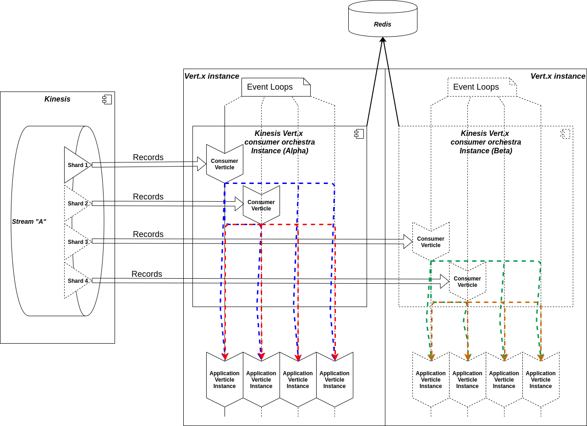

# vertx-kinesis-consumer-orchestra
**Terminolgy**
VKCO: Abbreviation for "Vert.x Kinesis consumer orchestra". 

## Getting started
Don't want to read and just start? [Getting started](https://github.com/wem/vertx-kinesis-consumer-orchestra/wiki/Getting-started) 

## Problem to solve
Short: Bring Kinesis records into the non-blocking, reactive and scaling Vert.x world. 

There are some solutions out there to consume records from Kinesis. But either they follow basically another approach, 
are not maintained anymore or lacks of features.

### Goals
- Performance -> When Kinesis is not the limiting factor, it becomes very important the processing of consumed records
can be done fast or even better, flexible scalable.
- Scalable -> This encompasses two aspects.
    - First scaling with Kinesis shards, so we should be able to reshard and the system get reorganized (or re-orchestrated)
    if this happens.
    - If we change something on record processing we should be able to assign more resources (hardware) to the system and
    afterwards the throughput / output should increase.
- Reliable -> The system should be enough reliable to handle ungracefully shutdowns and able to restart from the last known point
(in this case segments of records)
- Simple -> We want to save the user of this library from handling the whole iterator and error handling effort as possible.

## Concept
### Big picture

### One event loop per shard
The may most central concept behind VKCO is that each shard get consumer by exactly one event loop and this even when
multiple instances of VKCO within same application and same stream are running. This is also ensured when run VKCO
on different Vert.x instances, regardless if they are running in clustered mode or not (but it's recommended to run Vert.x clustered)

#### Over-committing
_We say explicitly "one event loop per shard" and not "one shard per event loop"._ It's possible to configure VKCO to consume
`n` shards on a single event loop. This can make sense where Kinesis is the limiting factor, and the afterward processing
is faster.

#### Fan out
As mentioned above each shard get consumed by exactly one event loop. The consumer verticle is the point where the consumed
records finally arrive. So it's up to the implementation how to scale the final processing of those records. According to
the picture above, e.g. a well scaling and performant approach could be to split each consumed bunch of records and dispatch them
over the event loops (maybe within consumer verticle). 
So, for example with 1 shard -> 1 event loops consumes and `n` event loops proceeds. This may would be the more common 
scenario where Kinesis is NOT the limiting factor.

### Entities
Entities the user of this library get directly contact with, or it's helpful to know anything about.

#### Redis
This library uses Redis for any persistence tasks and even resharding:
- Shard processing state -> Which shard get currently consumed or has finished (e.g. resharded)
- Shard iterator -> After each consumed bunch of records, the shard iterator has to be persisted for reliability.
- Deployment lock -> When more than one VKCO instance get started concurrently we must ensure they deploy the consumers
in sequential fashion to avoid one shard get consumed multiple times. To solve this a simple adaption of red-lock is used,
so in fact at a point in time during deployment only one VKCO instance owns this lock. **It's also guaranteed
when those VKCO instances are running on different Vert.x instances and they are not running in clustered mode**.
- Resharding -> When a shard or 2 shards get resharded, all corresponding VKCO instances must get notified.
As it's not mandatory to run Vert.x in clustered mode, when VKCO instances deployed on different Vert.x instances, we
must find another way to notify for such an event. Here Redis pub / sub comes into the game. **Note: When Vert.x is running
in clustered mode VKCO will use event bus instead of Redis pub / sub to notify about resharding events.**

> The decision for Redis was as it's able to take some tasks from Vert.x in clustered mode. So to prevent the user to
> get forced to run Vert.x clustered to use VKCO. And Redis should be enough reliable to act as persistence solution 
> for this case, especially when Redis itself is running clustered.

#### Vert.x Kinesis consumer orchestra `ch.sourcemotion.vertx.kinesis.consumer.orchestra.VertxKinesisOrchestra`
Umbrella abstraction and entry point of the library. After the configuration and creating / start there should be no further action
needed to run it.

#### Consumer verticle `ch.sourcemotion.vertx.kinesis.consumer.orchestra.consumer.AbstractKinesisConsumerVerticle`
Entity that finally consumes (polling) records from Kinesis. The scope of a consumer is one single Kinesis shard.
Specifically this means, per orchestra (application, stream) there exists only one consumer per shard.

This is the point in this library where the user has to provide its own implementation. 
Detailed description [Consumer verticle](https://github.com/wem/vertx-kinesis-consumer-orchestra/wiki/Consumer-verticle).

This README and the wiki will may grow further in the future. 

For now, start coding: [Getting started](https://github.com/wem/vertx-kinesis-consumer-orchestra/wiki/Getting-started)

Have fun.

:-)

## Contribution and bug reports
Both is very welcome. Btw ... Code of conduct will follow.
